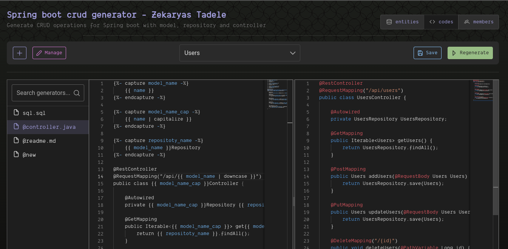

# The Codegen



- [The Codegen](#the-codegen)
  - [About](#about)
  - [Tech stacks used](#tech-stacks-used)
  - [Building \& running the project](#building--running-the-project)
    - [Before building or running, fill .env](#before-building-or-running-fill-env)
    - [Database setup](#database-setup)
    - [How to build the project for production](#how-to-build-the-project-for-production)
    - [How to run the project locally](#how-to-run-the-project-locally)
  - [Prisma Commands to remember](#prisma-commands-to-remember)
    - [Note on Prisma migration commands](#note-on-prisma-migration-commands)

## About
- TL:DR 
  - Codegen is a tool that uses templates and data schema to generate custom code snippets or projects.
- Codegen is a programmable code-generation tool based on the Liquid template engine. It allows developers to create custom templates for generating code snippets, files, or entire projects from various data schema. Codegen also provides features such as user management, syntax highlighting, and formatting to make the code-generation process easier and faster.

## Tech stacks used

- [Next.js 13](https://nextjs.org/), with TypeScript
  - Pages directory for UI
  - API folder for Serving Serverless APIs
- [NEXT.Auth](https://next-auth.js.org/) for Github authentication
- [React Monaco editor](https://github.com/react-monaco-editor/react-monaco-editor) for Code blocks
- [Liquid template engine](https://github.com/harttle/liquidjs)
- [React-markdown](https://github.com/remarkjs/react-markdown) for Markdown support with
  - [remark-gfm plugin](https://github.com/remarkjs/remark-gfm) to support GFM (autolink literals, footnotes, strikethrough, tables, tasklists)
  - [github-markdown-css](https://github.com/sindresorhus/github-markdown-css) to replicate the GitHub Markdown style
- [PrimeReact](https://primereact.org/) for UI
- [Prisma](https://www.prisma.io/) for DB ORM
- [Vercel](Vercel.com) for deployment

## Building & running the project

### Before building or running, fill .env
- Create a .env file at the root level, with the following information

```
# required env variables
DATABASE_URL=${postgres database url}
GITHUB_ID=${github client id}
GITHUB_SECRET=${github secret}
NEXTAUTH_SECRET=${random base64 value i.e openssl rand -base64 32}
```

```
# optional env variables
NEXT_PUBLIC_PROJECT_NAME=${Project name, "The Codegen"}
NEXT_PUBLIC_PROJECT_DESCRIPTION_MAX_LENGTH=${Length, 80}
```

### Database setup

- if you don't want to use postgresql, you can change the database to any other databases prisma supports
  - [For example: you can see here how to use sqlite](https://www.prisma.io/docs/concepts/database-connectors/sqlite)
- optionally, when working locally you can use [the docker-compose](docker-compose.yml) to spin up postgres database

```shell
docker-compose up -d
```

- _once you setup the .env files you can start building the project for both dev and prod environment_

### How to build the project for production

```shell
yarn add
yarn run vercel-build
yarn run start  # then open localhost:3000
```

### How to run the project locally

- right after cloning this project

```shell
1. yarn add
2. yarn run prisma generate
3. yarn run prisma db push
4. yarn run dev
```

- subsequent runs don't need the first 3 commands, unless you changed schema.prisma file.

```shell
yarn run dev
```

## Prisma Commands to remember

```shell
#to access database ui interface by prisma
npx prisma studio

# to generate type definition
prisma generate

#to automatically generates SQL migration files and apply them to the database
npx prisma migrate dev --name migration_name

#to format and let prisma generate relation
prisma format
```

### Note on Prisma migration commands

- When developing locally
  - to sync your Prisma schema with the database schema of your local development database
  - Use either `prisma migrate dev` or `prisma db push`
- For CI/CD or production environment
  - `prisma migrate deploy`
